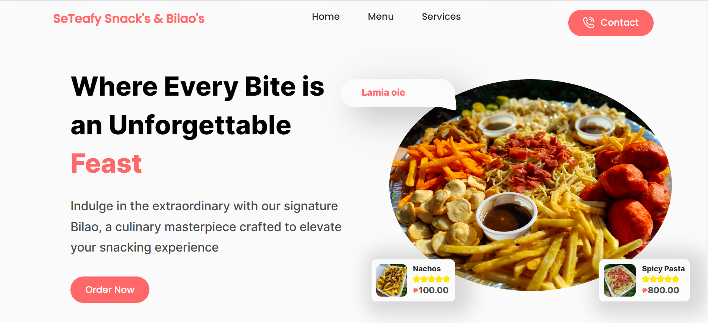

# SeTeafy Snack's & Bilao's Website

Welcome to the SeTeafy Snack's & Bilao's website repository! This simple and elegant website showcases the delectable offerings of SeTeafy Snack's & Bilao's, created using only HTML and CSS.

## Table of Contents

- [Introduction](#introduction)
- [Features](#features)
- [Getting Started](#getting-started)
- [Structure](#structure)
- [Contributing](#contributing)
- [License](#license)

## Introduction

This website is designed to provide a visually appealing and user-friendly interface for exploring the culinary delights offered by SeTeafy Snack's & Bilao's. The use of HTML ensures a structured layout, while CSS adds style and responsiveness to enhance the overall user experience.



## Features

- **Bilao Showcase:** Highlighting the hero dish, the Bilao, with enticing visuals and a description of its diverse offerings.
- **Owner's Special Delivery:** Emphasizing the personal touch of the owner's special delivery service.

- **Simplicity and Elegance:** Utilizing HTML and CSS for a clean and straightforward design that focuses on the essence of the culinary experience.
- **Mobile Responsive:** The website is designed to provide a seamless experience across various devices, ensuring accessibility and usability on both desktop and mobile platforms.

## Getting Started

To explore or contribute to the project, follow these steps:

1. **Clone the Repository:**

   ```bash
   https://github.com/shanepai-14/seteafy-website.git
   ```

2. **Open in a Browser:**

   - Navigate to the project directory.
   - Open `index.html` in your preferred browser.

3. **Make Changes:**

   - Modify HTML or CSS files as needed.
   - Refresh the browser to see the changes.

4. **Contribute:**
   - If you'd like to contribute, fork the repository, make your changes, and submit a pull request.

## Structure

The project structure is straightforward:

- `index.html`: The main HTML file that structures the content.
- `styles.css`: The CSS file containing styles for visual presentation.

## Contributing

Contributions are welcome! Whether you're fixing a bug, improving the design, or adding new features, feel free to contribute. Please follow the [contribution guidelines](CONTRIBUTING.md).

## License

This project is licensed under the [MIT License](LICENSE.md).

---

Thank you for exploring SeTeafy Snack's & Bilao's website. Enjoy the culinary journey! 🍽️🎉
